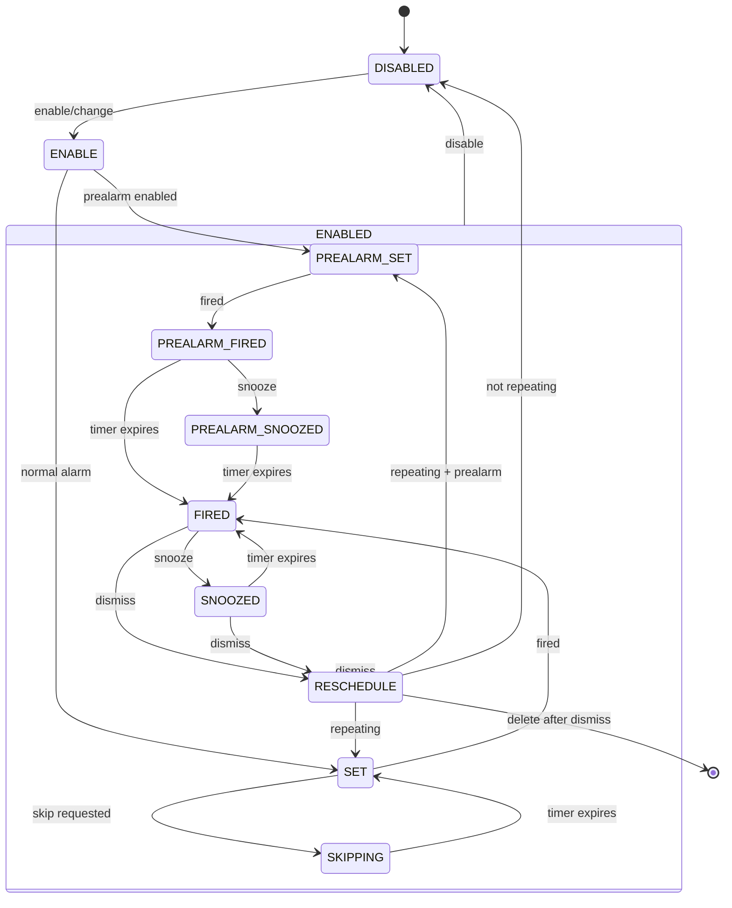

The domain layer contains the core business logic for alarm management. It's independent of Android framework details and defines clear interfaces for the UI layer.

## Core interfaces

### Alarm interface

The `Alarm` interface defines operations available on individual alarms:

```kotlin Alarm.kt
interface Alarm {
  fun enable(enable: Boolean)
  fun snooze()
  fun snooze(hourOfDay: Int, minute: Int)
  fun dismiss()
  fun requestSkip()
  fun isSkipping(): Boolean
  fun delete()
  
  // Change something and commit
  fun edit(func: AlarmValue.() -> AlarmValue)
  
  val id: Int
  val labelOrDefault: String
  val alarmtone: Alarmtone
  val data: AlarmValue
}
```

<Note>
The `edit()` function uses a functional approach, taking a lambda that transforms the current `AlarmValue` and immediately persists the change.
</Note>

### IAlarmsManager interface

The `IAlarmsManager` interface provides high-level alarm management:

```kotlin IAlarmsManager.kt
interface IAlarmsManager {
  fun enable(alarm: AlarmValue, enable: Boolean)
  fun getAlarm(alarmId: Int): Alarm?
  fun createNewAlarm(): Alarm
}
```

## AlarmCore state machine

The `AlarmCore` class implements the `Alarm` interface and manages alarm lifecycle using a state machine. Each alarm instance maintains its own state and handles transitions based on events.

### State diagram



### Key states

<CardGroup cols={2}>
  <Card title="DisabledState" icon="circle-stop">
    Alarm is turned off. Waits for enable event.
  </Card>
  <Card title="SetState" icon="clock">
    Alarm is scheduled. Has substates for normal and prealarm.
  </Card>
  <Card title="FiredState" icon="bell">
    Alarm is ringing. Can be snoozed or dismissed.
  </Card>
  <Card title="SnoozedState" icon="clock-rotate-left">
    Alarm is snoozed. Will fire again after snooze duration.
  </Card>
  <Card title="SkippingSetState" icon="forward">
    Alarm is skipped for the next occurrence.
  </Card>
  <Card title="DeletedState" icon="trash">
    Alarm is being deleted. Cleans up resources.
  </Card>
</CardGroup>

### State initialization

```kotlin AlarmCore.kt
fun start() {
  stateMachine.start {
    val root = RootState()
    addState(root)
    addState(disabledState, root)
    addState(enabledState, root)
    addState(deletedState, root)
    addState(rescheduleTransition, root)
    addState(enableTransition, root)

    addState(set, enabledState)
    addState(preAlarmSet, set)
    addState(normalSet, set)
    addState(snoozed, enabledState)
    addState(skipping, enabledState)
    addState(preAlarmFired, enabledState)
    addState(fired, enabledState)
    addState(preAlarmSnoozed, enabledState)

    val initial = mutableTree.keys.firstOrNull { it.name == alarmStore.value.state }
    setInitialState(initial ?: disabledState)
  }

  updateListInStore()
}
```

<Tip>
The state machine restores the previous state from persistent storage, ensuring alarms maintain their state across app restarts.
</Tip>

## Event system

The domain layer uses sealed classes to represent events that trigger state transitions:

```kotlin AlarmCore.kt
sealed class Event {
  override fun toString(): String = javaClass.simpleName
}

data class Snooze(val hour: Int?, val minute: Int?) : Event()
data class Change(val value: AlarmValue) : Event()
object PrealarmDurationChanged : Event()
object Dismiss : Event()
object RequestSkip : Event()
object Fired : Event()
object Enable : Event()
object Disable : Event()
object Refresh : Event()
object TimeSet : Event()
object InexactFired : Event()
object Delete : Event()
object Create : Event()
```

Events are sent to the state machine, which delegates to the current state:

```kotlin
fun enable(enable: Boolean) {
  stateMachine.sendEvent(if (enable) Enable else Disable)
}

fun snooze() {
  stateMachine.sendEvent(Snooze(null, null))
}

fun dismiss() {
  stateMachine.sendEvent(Dismiss)
}
```

## Alarms manager

The `Alarms` class implements `IAlarmsManager` and manages all alarm instances:

```kotlin Alarms.kt
class Alarms(
  private val prefs: Prefs,
  private val store: Store,
  private val calendars: Calendars,
  private val alarmsScheduler: IAlarmsScheduler,
  private val broadcaster: AlarmCore.IStateNotifier,
  private val alarmsRepository: AlarmsRepository,
  private val logger: Logger,
  private val databaseQuery: DatabaseQuery,
) : IAlarmsManager, DatastoreMigration {
  private val alarms: MutableMap<Int, AlarmCore> = mutableMapOf()

  fun start() {
    alarms.putAll(
      alarmsRepository.query().associate { store -> 
        store.id to createAlarm(store) 
      }
    )
    alarms.values.forEach { it.start() }
    if (!alarmsRepository.initialized) {
      migrateDatabase()
      if (alarms.isEmpty()) {
        insertDefaultAlarms()
      }
    }
  }

  override fun createNewAlarm(): Alarm {
    val alarm = createAlarm(alarmsRepository.create())
    alarms[alarm.id] = alarm
    alarm.start()
    return alarm
  }

  override fun getAlarm(alarmId: Int): AlarmCore? {
    return alarms[alarmId]
  }

  private fun createAlarm(alarmStore: AlarmStore): AlarmCore {
    return AlarmCore(
      alarmStore,
      logger,
      alarmsScheduler,
      broadcaster,
      prefs,
      store,
      calendars,
      onDelete = { alarms.remove(it) },
    )
  }
}
```

<Note>
The `Alarms` class acts as a factory and registry for `AlarmCore` instances. It handles initialization, migration from SQLite, and creation of default alarms on first launch.
</Note>

### Alarm scheduling

The domain layer delegates actual alarm scheduling to `IAlarmsScheduler`:

```kotlin
interface IAlarmsScheduler {
  fun setAlarm(id: Int, type: CalendarType, calendar: Calendar, alarmValue: AlarmValue)
  fun removeAlarm(id: Int)
  fun setInexactAlarm(id: Int, calendar: Calendar)
  fun removeInexactAlarm(id: Int)
}
```

This abstraction allows the domain layer to remain independent of Android's `AlarmManager` APIs.

## State broadcasting

When alarm state changes, the domain layer broadcasts intents:

```kotlin AlarmCore.kt
private fun broadcastAlarmState(action: String, calendar: Calendar? = null) {
  log.trace { "[Alarm ${container.id}] broadcastAlarmState($action)" }
  when {
    calendar != null -> broadcaster.broadcastAlarmState(container.id, action, calendar)
    else -> broadcaster.broadcastAlarmState(container.id, action)
  }
  updateListInStore()
}
```

Common broadcast actions include:
- `ALARM_ALERT_ACTION` - Alarm is firing
- `ALARM_DISMISS_ACTION` - Alarm was dismissed
- `ALARM_SNOOZE_ACTION` - Alarm was snoozed
- `ALARM_PREALARM_ACTION` - Prealarm is firing
- `ALARM_SHOW_SKIP` - Show skip notification

<Tip>
Broadcasts allow services and UI components to react to alarm state changes without tight coupling to the domain layer.
</Tip>
