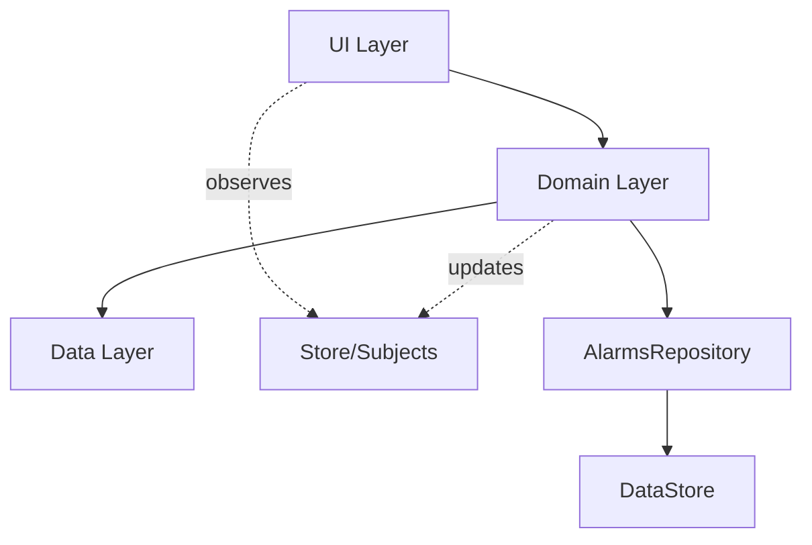

Simple Alarm Clock follows a clean architecture approach with clear separation between layers. The app uses Koin for dependency injection and RxJava for reactive data flows.

## Architecture layers

The app is organized into three main layers:

<CardGroup cols={3}>
  <Card title="Domain layer" icon="gear" href="/architecture/domain-layer">
    Business logic, alarm state machine, and core interfaces
  </Card>
  <Card title="Data layer" icon="database" href="/architecture/data-layer">
    Persistence with DataStore, repositories, and data models
  </Card>
  <Card title="UI layer" icon="mobile" href="/architecture/ui-layer">
    ViewModels, activities, fragments, and UI state management
  </Card>
</CardGroup>

## Dependency injection with Koin

The app uses [Koin](https://insert-koin.io/) for dependency injection, configured in `Container.kt`:

```kotlin Container.kt
fun startKoin(context: Context): Koin {
  val module = module {
    // Core components
    single<Store> {
      Store(
        alarmsSubject = BehaviorSubject.createDefault(ArrayList()),
        next = BehaviorSubject.createDefault<Optional<Store.Next>>(Optional.absent()),
        sets = PublishSubject.create(),
        events = PublishSubject.create()
      )
    }

    // ViewModels
    viewModelOf(::MainViewModel)
    viewModelOf(::AlarmDetailsViewModel)
    viewModelOf(::ListViewModel)

    // Domain layer
    single { Alarms(get(), get(), get(), get(), get(), get(), logger("Alarms"), get()) } binds
      arrayOf(IAlarmsManager::class, DatastoreMigration::class)

    // Data layer
    single<AlarmsRepository> {
      DataStoreAlarmsRepository.createBlocking(
        datastoreDir = get(named("datastore")),
        logger = logger("DataStoreAlarmsRepository"),
        ioScope = CoroutineScope(Dispatchers.IO),
      )
    }
  }

  return startKoin {
    allowOverride(true)
    modules(module)
    modules(loggerModule())
  }.koin
}
```

<Note>
The `Container.kt` file defines all dependencies and their lifecycles. Single instances are created once and reused, while factories create new instances on demand.
</Note>

## Key architectural patterns

### State machine

The `AlarmCore` class implements a state machine to manage alarm lifecycle:

- **DisabledState**: Alarm is turned off
- **EnabledState**: Alarm is active with substates:
  - SetState: Waiting to fire (NormalSetState or PreAlarmSetState)
  - FiredState: Alarm is ringing
  - SnoozedState: Alarm is snoozed
  - SkippingSetState: Alarm is skipped for one occurrence

### Active record pattern

The data layer uses an active record pattern where `AlarmStore` instances represent individual alarms and handle their own persistence:

```kotlin
interface AlarmStore {
  val id: Int
  var value: AlarmValue
  fun delete()
}
```

### Reactive streams

The app uses RxJava for reactive data flows:

```kotlin Store.kt
data class Store(
  val alarmsSubject: BehaviorSubject<List<AlarmValue>>,
  val next: BehaviorSubject<Optional<Next>>,
  val sets: Subject<AlarmSet>,
  val events: Subject<Event>,
)
```

<Tip>
The `Store` class acts as a central hub for alarm state changes. UI components observe these subjects to react to data changes.
</Tip>

## Dependency flow



The architecture ensures:

- **UI layer** depends on domain interfaces, not implementations
- **Domain layer** contains business logic and is independent of Android framework
- **Data layer** handles persistence and is abstracted behind repository interfaces
- **Reactive streams** enable decoupled communication between components

## Module organization

The source code is organized by layer:

- `com.better.alarm.domain/` - Domain logic (Alarms, AlarmCore, interfaces)
- `com.better.alarm.data/` - Data models and persistence (AlarmValue, AlarmsRepository)
- `com.better.alarm.ui/` - UI components (ViewModels, Activities, Fragments)
- `com.better.alarm.bootstrap/` - Dependency injection setup (Container)
- `com.better.alarm.services/` - Background services for alarm scheduling
- `com.better.alarm.receivers/` - Broadcast receivers for system events
